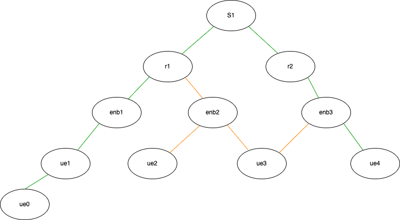
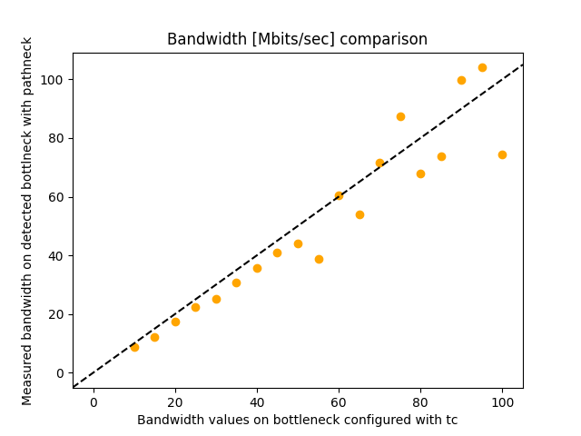
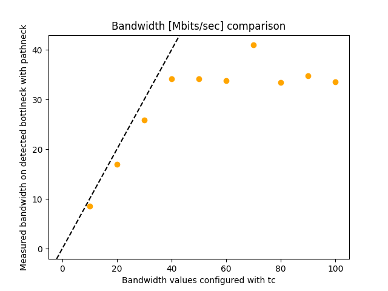

# Bottleneck Measurements
This directory contains experiments corresponding to two types of methods - using capacity and load - to determine bottleneck of a network with Pathneck.
- Capacity Determined Bottleneck
- Load Determined Bottleneck

## Capacity Determined Bottleneck
In this experiment the network topology shown below was
used and is implemented in the 
[network configuration file](./capacity-determined-bottleneck/layered-network/real_world-bw-limited.py)
of the relevant directory.

Configuring any link on the path to have less bandwidth
than the other and running Pathneck end-to-end to measure
the available bandwidth on the detected bottleneck links
yields the following results:

Now in another [experiment](./capacity-determined-bottleneck/layered-network/real-world-experiment-bw-limited.py)
the bandwidth on the *s1-r2* is fixed to a value of 40 Mbps while the bandwidth 
on the *r1-enb1* link is varied from 10 Mbps to 100 Mbps. The figure below
shows the results of running Pathneck end to end from the client
*ue5* to the server *ue1* to get an estimate of the available bandwidth on the
detected bottleneck link.

## Load Determined Bottleneck
