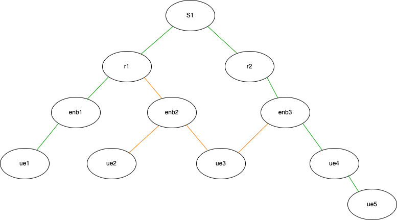
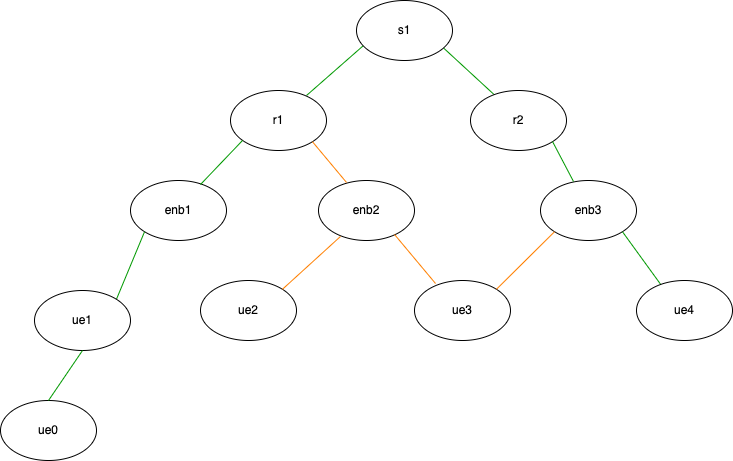
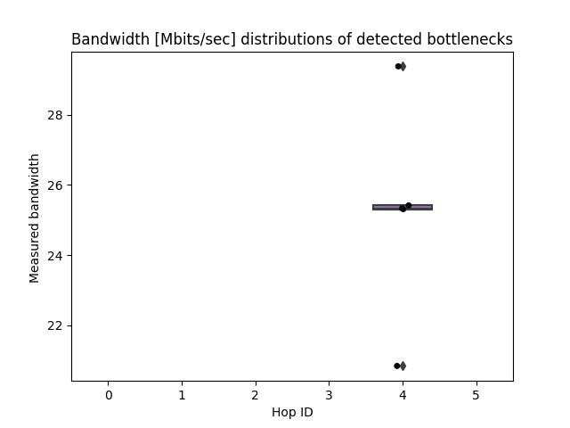

# Bottleneck Measurements
This directory contains experiments corresponding to two types of methods - using capacity and load - to determine bottleneck of a network with Pathneck.
- Capacity Determined Bottleneck
- Load Determined Bottleneck

## Capacity Determined Bottleneck
In this experiment the network topology shown below was
used and is implemented in the 
[network configuration file](./capacity-determined-bottleneck/layered-network/real_world-bw-limited.py)
of the relevant directory.

Configuring any link on the path to have less bandwidth
than the other and running Pathneck end-to-end to measure
the available bandwidth on the detected bottleneck links
yields the following results:

Now in another [experiment](./capacity-determined-bottleneck/layered-network/real-world-experiment-bw-limited.py)
the bandwidth on the *s1-r2* is fixed to a value of 40 Mbps while the bandwidth 
on the *r1-enb1* link is varied from 10 Mbps to 100 Mbps. The figure below
shows the results of running Pathneck end to end from the client
*ue5* to the server *ue1* to get an estimate of the available bandwidth on the
detected bottleneck link.

## Load Determined Bottleneck
This directory contains two types of network topologies [linear](../topologies/linear.py)
and [layered](load-determined-bottleneck/layered-network/real_world-load-determined.py), as well as experiments that test the capabilities of the system
to identify load determined bottlenecks.

### Linear
To create a load determined bottleneck a network with a [linear topology](../topologies/linear.py)
as shown in the figure below was set up.

The bandwidth on each link was set to 100 Mbps and in the [experiment](load-determined-bottleneck/linear-network/pathneck-bw-measurements.py)
Pathneck was used to detect the bottleneck along the path from *c1* to *s1*
and estimate the available bandwidth. The figure below shows
the detected bottleneck on the x-axis and the estimated available
bandwidth on the y-axis. The correct bottleneck is detected and
the estimated bandwidth is about half of the available bandwidth
on the link as is expected.

In our experience if the cross-traffic has a significantly higher
rate than the path taken by Pathneck then either the link before
the bottleneck router is detected as bottleneck or the link right
after. This might be due to how queueing takes place on the router
but it is unclear why Pathneck would estimate the link before the 
bottleneck router to be the bottleneck. Also, the estimated available
bandwidth on the link after the bottleneck router is too
optimistic as it reports that the bandwidth on the link
would be fairly shared. The figure below shows the results when the capacity
on the link between *c2* and *r2* is set to 400 Mbps.

In order to accurately detect bottlenecks and estimate available
bandwidth on a path, Pathneck relies on gap value measurements
which are influenced by other traffic on the path. Therefore,
there needs to be some traffic on the path from *c1* to *s1*.
It is unclear how to do this effectively. Generating UDP traffic
on each link on the path has not been effective as that gives
similar results to having no traffic. Now generating TCP traffic
either end to end or on each link on the path has given accurate
results when identifying capacity determined bottlenecks. However, 
using when combined with cross-traffic the estimates of the 
available bandwidth on the bottleneck are less accurate and 
consistent. The figure below shows the results when each link
in the network has a capacity of 100 Mbps and there is generated
traffic from *c1* to *s1*. The correct bottleneck is detected
but the estimates of the available bandwidth show more variance
but still are ovearll lower than what would be estimated if there was
no cross-traffic from *c2* was generated.

As Pathneck relies on gap value measurements to estimate
both the bottleneck as well as the estimated bandwidth
on the bottleneck it was tested whether it would be able
to detect capacity determined bottlenecks while there
is cross-traffic as well on an earlier link. For this the
same setup as before was run but with the capacity of the 
link between *r3* and *r4* set to 30 Mbps. The results 
show that the correct bottleck is detected 
with a good estimate of the available bandwidth.

Overall the system can be expected to find the correct bottleneck
but in a setting with cross-traffic the estimated bandwidth
shows higher variance and the threshold to determine a capacity determined
bottleneck becomes slightly higher.

### Layered
Similar [experiments](./load-determined-bottleneck/layered-network/real-world-experiment-load-determined.py)
were carried out for the [layered network topology](./load-determined-bottleneck/layered-network/real_world-load-determined.py)
shown in the figure below.

For the load determined bottleneck the capacity of every
link along the path taken by Pathneck (shown in green)
was set to 100 Mbps and a cross-traffic of 100 Mbps
was generated from *enb2* over the link between *r1* and
*enb1*. As with the linear setup the correct
bottleneck was determined, i.e. the link between *r1* and *enb1*,
with similar values for the estimated available bandwidth.

For the capacity determined bottleneck the capacity of the
link between *enb1* and *ue1* was set to 30 Mbps as before
and the results are similar i.e. the correct bottleneck is
detected with a good estimate of the available bandwidth.

