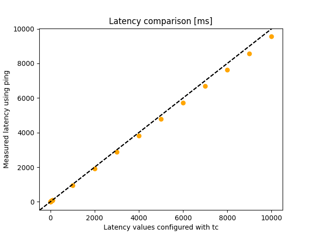

# Bandwidth and Latency Experiment
An experiment 1) comparing measured bandwidth using iperf with
bandwidth configured with tc tbf and 2) comparing measured latency using ping with
latency configured with tc tbf. This experiment can be run
on an existing topology.

## Example
Measuring bandwidth with Iperf and latency with Ping 
for various bandwidth and latency values on a network
of four containers with a linear topology yields the 
following results.

### Bandwidth

### Latency
