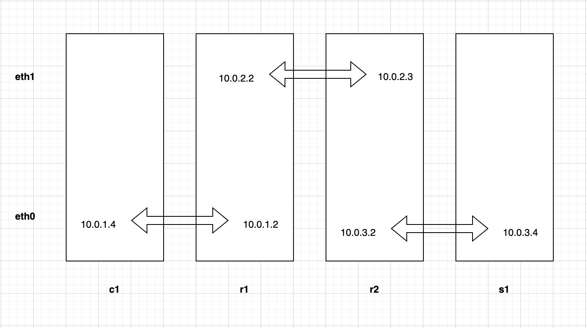

# Linear topology
Launches containers c1, r1, r2 and s1 where r1 and r2 act as routers and
forward traffic between the client c1 and the server s1. The
configuration is shown in the figure below.



## Run locally
To launch the containers in the configuration above run
the script *linear.sh* from the *linear* directory i.e.
the current working directory.
```
./linear.sh
```

## Examples

### Ping
The server s1 can be pinged from c1 as follows
```
ping 10.0.3.4
```
### Traceroute
Traceroute can be run from c1 as follows
```
traceroute 10.0.3.4
```
### Iperf
An iperf server can be set up on s1 as follows
```
iperf -s
```
then an iperf client can be set up on c1 to contact s1 as follows
```
iperf -c 10.0.3.4
```
### Echo server
An echo server can be started on s1 as follows
```
python3 /usr/src/app/echo_server.py
```
then a client can be run on the client c1 as follows
```
# python3 /usr/src/app/echo_client.py
Hello there, s1!
```