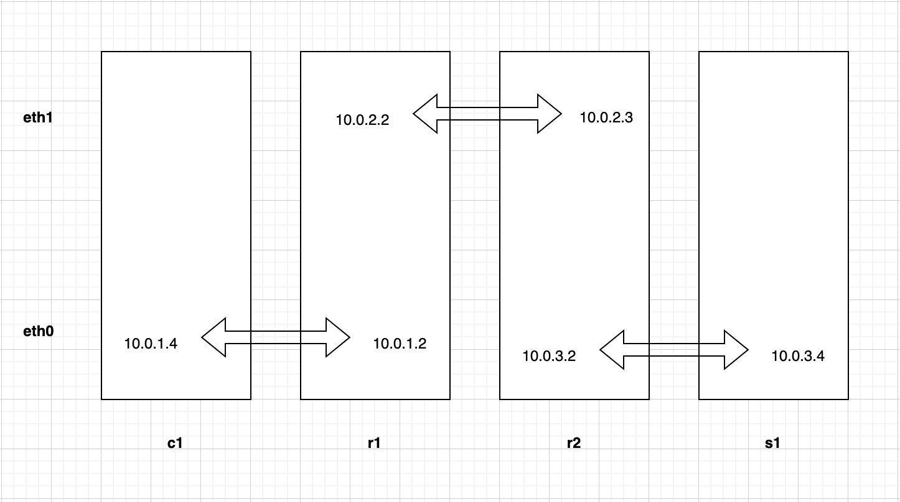

# Linear topology
Launches containers c1, r1, r2 and s1 where r1 and r2 act as routers and
forward traffic between the client c1 and the server s1. The
configuration is shown in the figure below.



## Run locally
To launch the containers in the configuration above run
the script *linear.sh* from the *linear* directory i.e.
the current working directory.
```
./linear.sh
```
